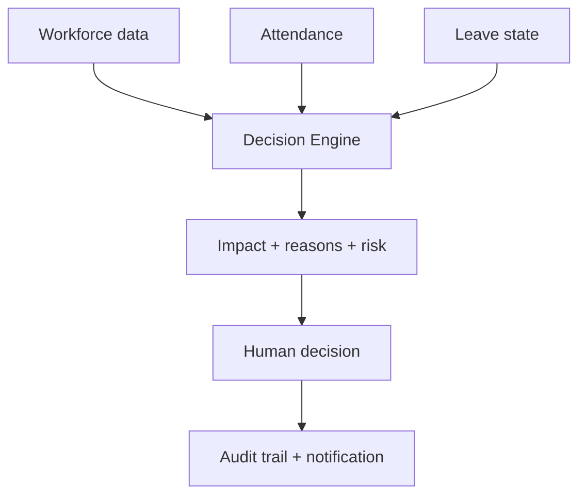
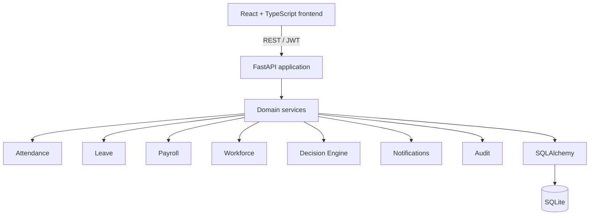

# Dayflow

### Every workday, intelligently aligned.

An explainable workforce operating system that combines everyday HR workflows with decision-before-action intelligence.

[](https://react.dev/) [](https://www.typescriptlang.org/) [](https://fastapi.tiangolo.com/) [](https://www.python.org/) [](https://sqlite.org/) [](#verification)

## Why Dayflow?

Traditional HRMS products are good at recording decisions after they happen. Dayflow connects attendance, leave, workforce, and payroll context so HR can understand operational consequences before acting. Its central question is simple: **what happens if we make this decision?** The final decision remains with a human, with the evidence preserved through audit events and notifications.

### Traditional HRMS

```text
Record
    ↓
Store
    ↓
Display
```

### Dayflow

```text
Record
    ↓
Understand
    ↓
Preview impact
    ↓
Decide
    ↓
Audit
```

## Decision-before-action intelligence

The Decision Engine is Dayflow's hero workflow. Before approving a pending leave request, HR can preview its effect on the employee's team using persisted employee and leave records.

The verified demo example is:

```text
Current Engineering coverage: 100%
If approved:                       50%
Impact:                            -50 percentage points
```

The calculation is deterministic:

- The Engineering team has 2 employees.
- The request affects 1 employee.
- Existing overlapping approved and pending absences are queried for the requested dates.
- Current and projected availability are recalculated from database records.

The engine returns current coverage, projected coverage, coverage delta, overlapping absences, risk classification, recommendation, and human-readable reasons. It is deliberately deterministic and explainable; it does not present an opaque machine-learning prediction. HR remains in control of the action.



## What Dayflow includes

| Employee experience | HR experience |
| --- | --- |
| Secure login | HR command center |
| Personal dashboard | Workforce management |
| Check-in and check-out | Team attendance |
| Attendance history | Explainable attendance signals |
| Leave requests and status | Leave approval and rejection |
| Safe profile updates | Decision Center |
| Own payroll view | Payroll management |
| In-app notifications | Audit activity timeline |

## Explainable attendance signals

Attendance signals are generated from real attendance records and expose the rule that triggered them:

- **Missing checkout:** an attendance record has an open check-in.
- **Short shift:** a completed shift is under 4 hours and is classified as half-day.
- **Overtime:** a completed shift exceeds 10 hours.
- **Lateness:** the current release does not infer lateness without a configured work-time baseline, so it does not invent a lateness score.

Dayflow surfaces reasons rather than hiding them behind a black-box score.

## Security and role boundaries

- JWT authentication protects authenticated API requests.
- Role-based authorization is enforced server-side with separate employee and HR access paths.
- Employees can access their own profile, attendance, leave, payroll, and notifications.
- HR-only workforce, payroll, decision, and audit resources require the HR role.
- An employee requesting the HR-only employee listing receives HTTP `403`.

The local demo is not presented as a production deployment. Secrets should be configured differently before production use.

## Architecture



## API surface

The backend exposes these functional API groups:

```text
/api/auth
/api/employees
/api/attendance
/api/leaves
/api/payroll
/api/dashboard
/api/decisions
/api/notifications
/api/audit
```

FastAPI Swagger documentation is available locally at [http://127.0.0.1:8000/docs](http://127.0.0.1:8000/docs).

## Verification

The current competition checkpoint has the following verified evidence:

- 9 automated backend tests passing.
- Backend compilation passing.
- Frontend production build passing.
- Fresh HR browser login verified.
- Fresh Employee browser login verified.
- Decision Engine browser flow verified with the `100% -> 50%` coverage example.
- Critical browser API requests returned HTTP `200` during the verified flow.
- No console, CORS, or React errors were observed on the verified critical path.

Run the backend tests with:

```bash
PYTHONPATH=. .venv/bin/pytest -q
```

## Run locally

Prerequisites:

- Python compatible with the repository environment.
- Node.js and npm.

### Backend

From the repository root:

```bash
python3 -m venv .venv
source .venv/bin/activate
pip install -r backend/requirements.txt
python -m backend.app.seed
.venv/bin/uvicorn backend.app.main:app --host 127.0.0.1 --port 8000
```

### Frontend

In a second terminal:

```bash
cd frontend
npm install
npm run dev -- --host 127.0.0.1
```

Open the application at [http://127.0.0.1:5173/](http://127.0.0.1:5173/).

API docs are at [http://127.0.0.1:8000/docs](http://127.0.0.1:8000/docs).

The seeded demo database is created under `backend/data/` and is local application data. It is intentionally ignored by Git so the repository does not package a developer database.

## Demo accounts

**LOCAL DEMO CREDENTIALS ONLY**

### HR

```text
Email:    hr@dayflow.local
Password: Admin123!
```

### Employee

```text
Email:    employee@dayflow.local
Password: Employee123!
```

## Repository structure

```text
dayflow-hrms/
├── backend/
│   ├── requirements.txt
│   └── app/
│       ├── auth.py
│       ├── db.py
│       ├── main.py
│       ├── models.py
│       ├── schemas.py
│       ├── seed.py
│       ├── services.py
│       └── routes/
│           ├── attendance.py
│           ├── audit.py
│           ├── auth.py
│           ├── dashboard.py
│           ├── decisions.py
│           ├── employees.py
│           ├── leaves.py
│           ├── notifications.py
│           └── payroll.py
├── frontend/
│   ├── package.json
│   ├── index.html
│   └── src/
│       ├── App.tsx
│       ├── index.css
│       ├── main.tsx
│       └── vite-env.d.ts
├── docs/
│   └── BUILD_NOTES.md
├── scripts/
│   └── dev_up.sh
├── tests/
│   └── test_api.py
└── README.md
```

## Product walkthrough

No product screenshots are committed yet, so this README does not include invented or broken image links. The recommended screenshots to add later are:

1. HR Command Center with live workforce metrics.
2. Decision Center showing the verified `100% -> 50%` impact.
3. Employee dashboard after login.
4. Team attendance with explainable signals.
5. Audit activity timeline.

## Design principles

- Explainable over opaque.
- Dynamic over hard-coded.
- Server-enforced authorization.
- Human-in-the-loop decisions.
- Reliability over unnecessary complexity.

## Built for

**Odoo x NMIT Bangalore Hackathon 2026**
